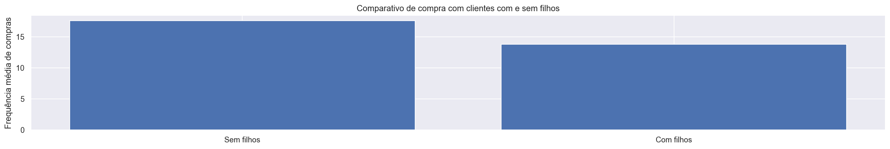
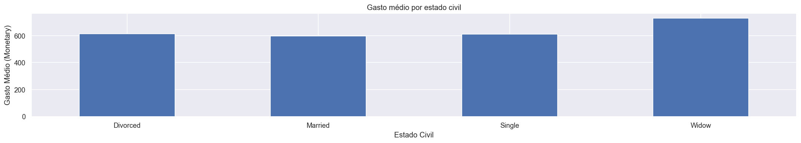
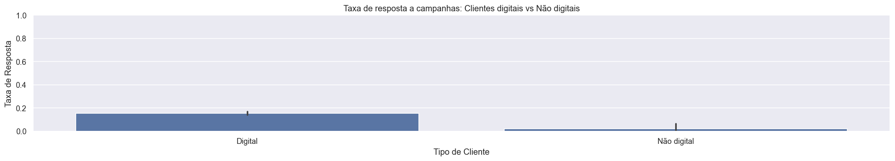
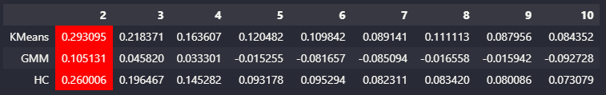
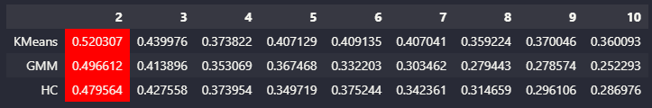
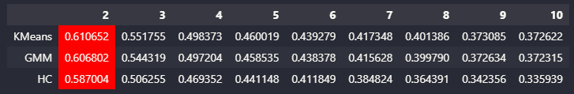
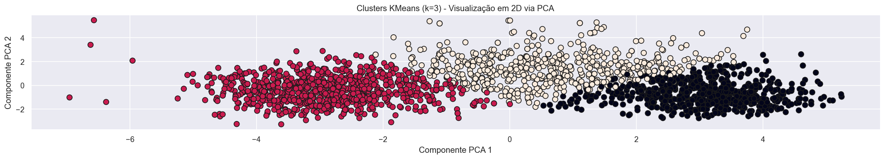

# Como executar o projeto:

### Clonar o repositório: git clone https://github.com/leonardonassibfonseca/segmentacao_de_clientes.git

### Entrar na pasta do projeto: cd segmentacao_de_clientes

### Instalar dependências (desenvolvido em Python 3.11): pip install -r requirements.txt

### Abrir o Jupyter Notebook: jupyter notebook

# Segmentação de Clientes

Como segmentar os clientes de forma estratégica para compreender diferentes perfis de comportamento de compra e apoiar decisões de negócio?

## 1.	Problema de negócio
Este projeto tem como objetivo segmentar a base de clientes de uma empresa, identificando grupos com comportamentos e características semelhantes, a fim de apoiar decisões estratégicas de marketing, CRM e gestão de relacionamento.

## 2.	Objetivo
Identificar segmentos distintos de clientes com base em características demográficas e comportamentais, permitindo compreender quem são os clientes mais valiosos, quais padrões de consumo existem e como direcionar estratégias de marketing de forma mais eficiente.

## 3.	Premissas do negócio
Seguem abaixo as premissas para as variáveis abaixo: 

**ID** – Identificador único do cliente

**Year_Birth** - Ano de nascimento do cliente

**Education** - Nível educacional

**Marital_Status** – Estado civil

**Income** - Renda anual do cliente

**Kidhome** - Número de crianças em casa

**Teenhome** - Número de adolescentes em casa

**Dt_Customer** - Data de cadastro do cliente 

**Recency** – Número de dias desde a última compra

**MntWines** - Valor gasto em vinhos nos últimos 2 anos

**MntFruits** - Valor gasto em frutas nos últimos 2 anos

**MntMeatProducts** - Valor gasto em carnes nos últimos 2 anos

**MntFishProducts** - Valor gasto em peixes nos últimos 2 anos

**MntSweetProducts** - Valor gasto em doces nos últimos 2 anos

**MntGoldProds** - Valor gasto em produtos premium nos últimos 2 anos

**NumDealsPurchases** - Número de compras com descontos

**NumWebPurchases** - Número de compras realizadas via website

**NumCatalogPurchases** - Número de compras realizadas via catálogo

**NumStorePurchases** - Número de compras realizadas na loja física

**NumWebVisitsMonth** - Número de visitas ao website no último mês

**AcceptedCmp1** - Aceitou a campanha 1 (1 = Sim, 0 = Não)

**AcceptedCmp2** - Aceitou a campanha 2 (1 = Sim, 0 = Não)

**AcceptedCmp3** - Aceitou a campanha 3 (1 = Sim, 0 = Não)

**AcceptedCmp4** - Aceitou a campanha 4 (1 = Sim, 0 = Não)

**AcceptedCmp5** - Aceitou a campanha 5 (1 = Sim, 0 = Não)

**Complain** - Registrou reclamação nos últimos 2 anos (1 = Sim, 0 = Não)

**Z_CostContact** - Custo de contato

**Z_Revenue** - Receita (provavelmente constante)

**Response** - Respondeu à última campanha (1 = Sim, 0 = Não)

## 4.	Estratégia adotada para solução

**Passo 1 - Descrição dos dados:** O objetivo deste passo é ter um entendimento inicial de como os dados estão relacionados com o problema de negócio proposto.

**Passo 2 - Engenharia de variáveis:** Neste passo serão criadas hipóteses relativas ao negócio e também se necessário, poderão ser criadas novas variáveis a partir das variáveis originais a fim de melhorar a qualidade dos dados facilitando seu o entendimento.

**Passo 3 - Filtragem das variáveis:** Nesta etapa, é realizada a filtragem das variáveis com base nas restrições do negócio, ou seja, isso significa verificar se todas as variáveis essenciais estarão disponíveis na base de dados, garantindo que as informações necessárias para o modelo ou análise estejam presentes e possam ser acessadas durante a produção. Essa verificação é crucial para evitar erros futuros e assegurar que o sistema funcione corretamente quando for implementado em um ambiente de produção. Além disso, podemos identificar variáveis redundantes ou irrelevantes, que podem ser removidas para otimizar o desempenho.
 
**Passo 4 - Análise exploratória:** A análise exploratória dos dados (EDA) tem como principal objetivo proporcionar uma compreensão mais aprofundada dos dados, tais como: Compreender a distribuição das variáveis numéricas e categóricas, identificar outliers (valores atípicos), correlações entre  as variáveis entre outras análises.

**Passo 5 - Preparação dos dados:** Neste tópico, os dados poderão ser transformados, ou seja, as variáveis categóricas poderão ser convertidas em números, as variáveis numéricas poderão ser reescalados, em outras palavras, colocadas em uma escala comum. Também neste passo, serão testados os algoritmos de machine learning para avaliação.

**Passo 6 - Seleção das variáveis:** O objetivo deste passo é identificar e selecionar o conjunto de variáveis mais relevantes para a etapa de modelagem, reduzindo a dimensionalidade dos dados e eliminando redundâncias ou variáveis com baixo poder informativo.

**Passo 7 - Implementar os modelos de machine learning:** Neste passo, serão implementados os algoritmos de machine learning não supervisionados com o objetivo de identificar padrões e segmentações naturais na base de clientes.

**Passo 8 - Avaliação do modelo final:** Nesta etapa é realizada a avaliação do modelo escolhido para clusterização, ou seja, o modelo que apresenta o melhor equilíbrio entre qualidade estatística, estabilidade dos clusters e relevância para o negócio, sendo este o modelo adotado para a segmentação final dos clientes.

**Passo 9 - Análise dos clusters:** Nesta etapa, os clusters resultantes da modelagem são interpretados a partir das variáveis originais, buscando identificar perfis distintos de clientes.
 
## 5.	Top 3 insights
**Hipótese 1:** Clientes com filhos compram mais frequentemente que clientes sem filhos?.

**Falsa:** Clientes sem filhos compram com mais frequencia ligeiramente maior que clientes com filhos.

**Hipótese 2:** Clientes casados compram mais que clientes solteiros?.

**Falsa:** Clientes casados não compram mais que clientes solteiros, a diferença é bem sutil, os clientes viúvos é que compram mais.

**Hipótese 3:** Clientes digitais respondem menos a campanhas?.

**Falsa:** Os clientes digitais respondem significativamente mais às campanhas do que os clientes não digitais.

## 6.	Aplicação do modelo de machine learning
Foram avaliados diferentes algoritmos de clusterização não supervisionados. Inicialmente, os modelos foram aplicados sem técnicas de redução de dimensionalidade, resultando em baixos valores de Silhouette, indicando dificuldade na separação dos grupos.

Em seguida, foram testadas técnicas de redução dimensional como PCA, UMAP e t-SNE, que melhoraram a separação visual, porém com limitações quando poucos componentes explicavam a variância total.

Por fim, uma abordagem baseada em modelos de árvore foi utilizada para seleção das variáveis mais relevantes, tendo a variável monetary como target. Essa estratégia preservou relações não lineares dos dados e resultou em ganhos significativos na qualidade da clusterização, com destaque para o algoritmo K-Means.

## 7.	Performance do modelo de machine learning
A análise combinando a projeção em PCA (para fins de visualização) e o coeficiente Silhouette indica que o algoritmo KMeans com k = 3 oferece uma segmentação estável, coerente e compatível com a estrutura encontrada nos dados. Observa-se que o cluster central apresenta a melhor coesão interna, enquanto os outros dois grupos revelam comportamentos distintos, um mais disperso e outro mais concentrado, sugerindo padrões bem diferenciados entre os clientes.

Apesar de alguma sobreposição entre regiões de fronteira, o modelo KMeans consegue identificar três perfis consistentes:

**Cluster (preto):** grupo mais bem definido, alta coesão e comportamento homogêneo.

**Cluster (branco):** grupo intermediário, com características mais mistas, refletindo maior variação interna.

**Cluster (vermelho):** grupo mais disperso, apresentando maior heterogeneidade e proximidade entre regiões de fronteira.

Essa estrutura é comum em bases de comportamento de clientes, onde a segmentação tende a refletir gradientes contínuos em vez de limites rígidos. Ainda assim, a separação obtida fornece insights relevantes para estratégias de marketing, atendimento e priorização comercial.
 

## 8. Análise dos clusters
**Clientes Premium de Alto Valor (cluster 1)**
* Este é o grupo mais valioso da base, com maior gasto total e comportamento de compra mais consistente. Este cluster representa clientes de alto poder aquisitivo, maduros, fiéis e com alto valor para a empresa. Eles respondem bem a campanhas e realizam compras frequentes e de produtos de maior ticket.

* Características principais:
    * Renda: Alta com média de R$ 73.294 (a maior entre os grupos)
    * Idade: Média de 57 anos
    * Gasto: Médio de R$ 1.270,65
    * Consumo: Elevado de vinhos, carnes e produtos premium
    * Frequência de compras: Alta com média de 20,9 compras
    * Dependentes: Baixa presença de dependentes
    * Engajamento: Maior engajamento com campanhas
    * Canal de compra: Multicanal, especialmente loja física, catálogo e website
 
**Recomendação:** Para estes clientes, deve ter um o foco maior na retenção, programas VIP e campanhas exclusivas, pois representa a maior fatia de receita.
##
**Clientes de Baixo Valor e Baixo Engajamento (cluster 2)**
* Grupo com menor renda, baixo gasto e reduzido envolvimento com campanhas da empresa. Este cluster representa clientes sensíveis a preço, pouco fiéis e de baixo LTV. São esporádicos e dificilmente respondem a campanhas.

* Características principais:
    * Renda: Baixa com média de R$ 33.262
    * Idade: Média de 53 anos
    * Gasto: Médio de R$ 71,42
    * Consumo: Menor consumo em todas as categorias
    * Frequência de compra: Baixa com média de 7,08 compras
    * Dependentes: Maior número de dependentes
    * Engajamento: Quase nulo com campanhas
    * Canal de compra: Presenciais e poucas compras online
 
**Recomendação:** Para este grupo, seriam necessárias mais ações de ativação e reengajamento, mas possui baixo potencial de monetização.
##
**Clientes de Consumo Moderado (cluster 3)**
* Grupo intermediário, com poder aquisitivo médio e comportamento de compra consistente, porém menos intenso que o cluster premium. Este cluster é composto por clientes estáveis, com boa renda e comportamento relativamente previsível. Apesar de não serem tão valiosos quanto o cluster 0, apresentam um bom potencial para campanhas personalizadas.

* Características principais:
    * Renda: Moderada com média de R$ 55.496
    * Idade: Média de 59 anos
    * Gasto: Moderado com média de R$ 617,09
    * Consumo: Preferencialmente vinhos e carnes
    * Frequência de compras: Moderada com média de 19,39 compras
    * Dependentes: Maior quantidade de adolescentes como dependentes
    * Engajamento: Moderada às campanhas
    * Canal de compra: Boa atividade multicanal

**Recomendação:** Para estes consumidores demonstram uma base sólida para upsell, cross-sell e campanhas personalizadas, especialmente em categorias premium de menor consumo.

## 9.	Conclusão
A análise de segmentação de clientes permitiu identificar padrões consistentes de comportamento de consumo, engajamento e valor ao longo da base analisada. Por meio da aplicação de técnicas de preparação dos dados, análise de variância, correlação, redução de dimensionalidade e diferentes algoritmos de clusterização, foi possível construir uma segmentação robusta, interpretável e relevante para o negócio.

Embora a análise exploratória e algumas métricas estatísticas indicassem a possível existência de até cinco clusters, optou-se estrategicamente pela utilização de três clusters. Essa decisão priorizou simplicidade, interpretabilidade e aplicabilidade prática, garantindo que os segmentos possam ser facilmente compreendidos e utilizados pelas áreas de negócio, sem perda significativa de informação relevante.

Os três clusters finais representam perfis bem definidos e refletem um cenário realista e comum em bases de comportamento de clientes, nas quais não existem fronteiras perfeitamente delimitadas, mas sim gradientes contínuos de valor e engajamento. A segmentação obtida gera insights acionáveis, possibilitando o direcionamento mais eficiente de campanhas, estratégias de retenção e alocação de recursos.

Em síntese, o modelo final baseado em K-Means com três clusters apresentou um equilíbrio adequado entre qualidade estatística, estabilidade do agrupamento e valor estratégico para o negócio, cumprindo o objetivo central do projeto de apoiar decisões orientadas por dados na gestão de clientes.

### Relatório Final de Resultados: https://github.com/leonardonassibfonseca/segmentacao_de_clientes/blob/main/Relat%C3%B3rio%20Final%20de%20Resultados.pdf

## 10.	Próximos passos
•	Utilizar outras técnicas para tratamento de grandes dados;

•	Testar outros algoritmos de machine learning;

•	Implementar mais variáveis para definir melhor o comportamento dos consumidores;

•	Fazer o deploy deste projeto em ambiente cloud.
